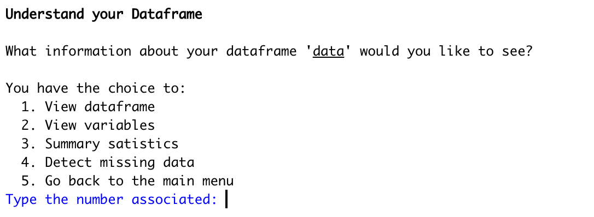
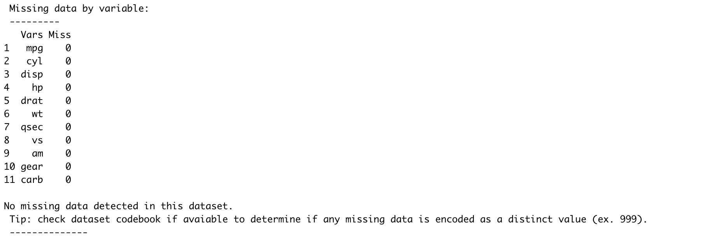
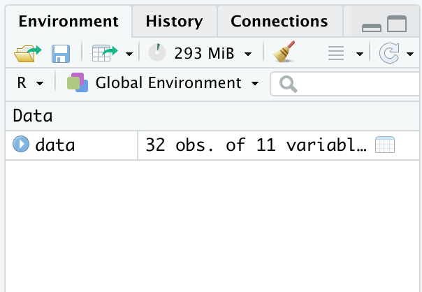
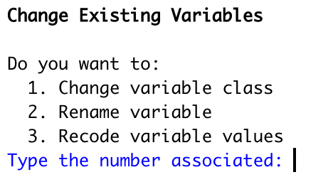
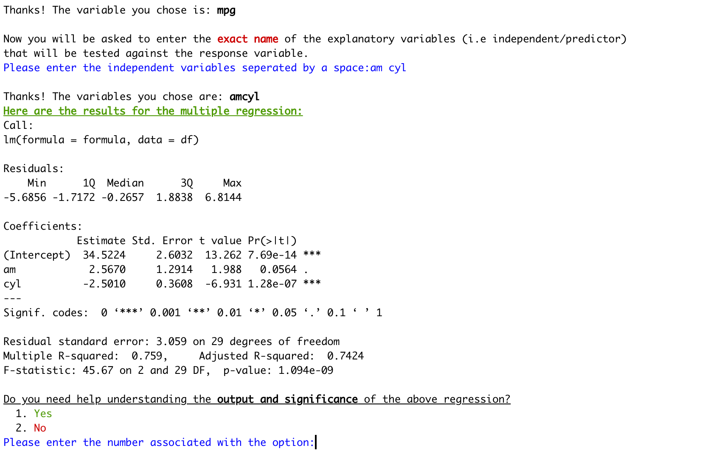

```{r, include = FALSE}
knitr::opts_chunk$set(
  collapse = TRUE,
  comment = "#>"
)
```

------------------------------------------------------------------------

## *Introduction*

SimpleR aims to get you through the basics of learning about your dataset, simple data management techniques, as well as executing multiple regression analysis without writing a single line of code. The intention of simpleR is to make data managment and analysis in R super easy for beginner or new users.

#### In simpleR you can do the following things with [no code needed]{style="color: red;"}:

-   **Import** your data frame to R

-   **View** your data frame and the variables in it

-   Get **summary statistics of each variable** in your data frame

-   Change variables **name** and **class**

-   **Recode** values in your variables

-   **Keep/remove** observations or variables

-   Conduct an in-depth **multiple regression** with explanations of what everything means

<center>


</center>

------------------------------------------------------------------------

## *Getting started*

To get started, simply load the package and run the function: [simple()]{style="color: red;"} . It is really as easy as that. SimpleR is interactive, so let it walk you through your options and help you decide what to do next. If you are every stuck just read the instructions carefully.

------------------------------------------------------------------------

### You can get the package simpleR using R in two ways -

#### [First way]{style="color: green;"} -

Run the following code in a R script file or in the R console to load the package

```{r, eval = FALSE}
if(!require(remotes)){
  install.packages("remotes")}

remotes::install_github("arifaabbas/simpleR")

```

#### [Second way]{style="color: green;"}-

Run the following code in a R script file or in the R console to load the package

```{r, eval = FALSE}
install.packages("devtools")
library(devtools)
devtools::install_github("arifaabbas/simpleR")
```

------------------------------------------------------------------------

After the package is installed, please run this to load the package on your R session

```{r, eval=FALSE}
library(simple R)
  
```

------------------------------------------------------------------------

## Using the package simpleR

After the package is installed and loaded, just run the following code in the R script file or R console -

```{r, eval = FALSE}
simple()
```

This will initiate the [**interactive environment**]{style="color: red;"} in the console. Follow the prompt to import a data set to use for this session. It should look like this:

{width="500px"}

Once you import a dataset from the global environment or a new dataset you will be taken to the [main menu]{style="color: blue;"} where you can choose what to do next:

{width="550px"} 

If you select **option 2**, you will be taken to a set of options related to [understanding your data]{style="color: blue;"}. You can select any of these options and it will provide you with relevant information:

{width="500px"}

Check out this example when **option 4** is selected to view the [missing data]{style="color: blue;"} in each of the variables:

{width="700px"}

Selecting option 3 from the main menu will allow you to change your dataframe in the global environment. No saving is required; as you make changes, it will apply to your dataset. Don't worry, you will be given the option to copy your data so that you will not risk losing anything:

{width="350px"}

The changes you make will apply to the data in the global environment. To view the data, press "esc" and click on in the top right corner of the screen. Note that to view the full data, you have to be out of the simple() function. To keep making changes, you will have to re-load it:

{width="400px"}

**Option 1** allows you to do variable level subsetting by **removing** or **keeping** variables:

{width="350px"}

**Option 2** walks you through various actions to **change** something about your variables:

{width="225px"}

Check out this option to **change variable class**. The function will do all the work, you simply pick the variables, and the desired class. Remember, these changes apply to the data directly in your global environment:

{width="500px"}

Lastly, the last option from the main menu takes you to an easy step by step walkthrough of [multiple linear regression]{style="color: blue;"}. This section has tons of explanation so if things do not quite make sense, take a second to read through:

{width="700px"} 

{width="700px"}

The regression section also provides general dominance plots and analysis plots.

------------------------------------------------------------------------

## Thank you and hope you enjoy simpleR

If you are ever stuck, just read the prompts carefully as it entails all the information you need to guide you through the steps. Good luck!

<center>


</center>

by Neve Oren, Arifa Abbas, and Lars Delin ry{Using simpleR} %\VignetteEngine{knitr::rmarkdown} %\VignetteEncoding{UTF-8} ---

```{r, include = FALSE}
knitr::opts_chunk$set(
  collapse = TRUE,
  comment = "#>"
)
```
